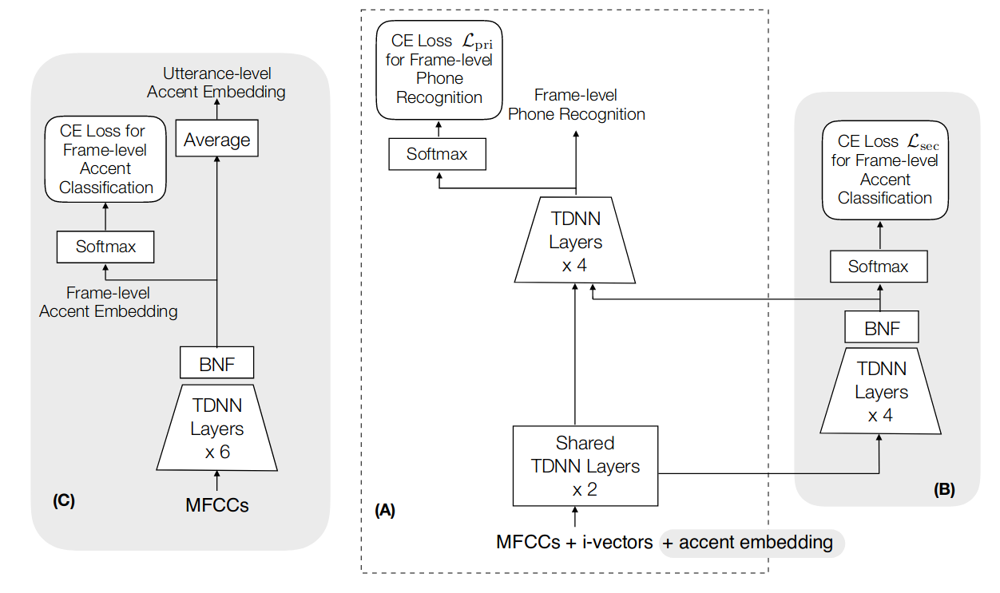
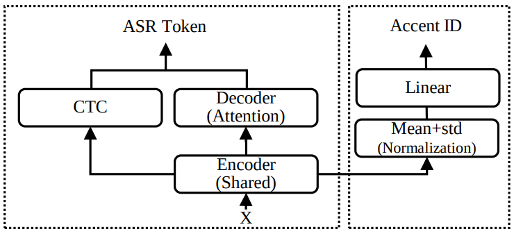

# Literature Review

We compare DAT and MTL when combined with accent classification. Both approaches require the same components: an acoustic model that follows an encoder-decoder architecture, and an accent classifier. The forward pass of both networks is the same: the input audio is passed to the layers of the acoustic model that it shares with the accent classifier. The output of these layers is passed to both the next layer of the acoustic model and to the accent classifier.

The difference between them lies in the backward pass. In MTL, the gradients flow backwards through both networks as is usual, encouraging the shared layers to learn an input representation that is favorable both for accent classification and for ASR. On the other hand, in DAT, the gradients of the accent classifier are reversed before being passed to the shared layers of the acoustic model, encouraging the model to learn an input representation that is accent-invariant. Thus, MTL encourages the shared layers to include accent information in their input representation, and DAT encourages them to discard accent information.

Here we look at the application of MTL and DAT to accented speech recognition. We first summarize the contributions of each paper and then discuss common aspects.

## Multi-task Learning (MTL)

(Jain 2018) was the first to combine MTL and AEs. It does so in a HPS setting. The acoustic model is a TDNN that receives MFCCs and i-vectors as input. Its intermediate output is passed to the accent classifier network, which is also a TDNN. The bottleneck features of the accent classifier are passed back to the acoustic model. Both networks use cross-entropy loss. The accent classifier is also trained independently with MFCCs as input. The difference with the standard MTL approach is that the AE is passed back to the acoustic model, serving also as data augmentation.

(Zhang 2021) proposes a MTL framework to perform E2E ASR and accent recognition. Their approach is different from conventional MTL approaches in that they focus on both tasks equally, i.e. there is no primary task. Their model is a transformer-based E2E network.

## Domain Adversarial Training (DAT)

(Sun 2018) performs DAT on the Kaldi TDNN network with an accent classifier that comprises two fully connected linear layers. It also experiments without reversing the classifier's gradient, i.e. by combining the models in MTL fashion, showing that MTL performs worse than DAT and also worse than the TDNN alone, without a secondary task. They argue that this is because MTL encourages the TDNN to learn domain-discriminative features, which can be at odds with the senone classification task.

An advantage of DAT is that it does not require transcribed data from the different accents. The shared layers of the ASR model are modified by the backward pass of the classifier.

## Acoustic models

The pre-trained Conformer Transducer is the best performing German ASR model out of the six considered in a study (Wirth 2022).

## Design choices

Other than which acoustic model and which accent classifier to choose, there are other degrees of freedom in the experiment that are worth considering.

### Number of shared layers

- (Jain 2018) shares very few layers.
- (Das 2021) shares all blocks but the last one.
- (Viglino 2019) achieves slightly better results when sharing 4 layers instead of 3 (out of 5).
- (Zhang 2021) experiments with sharing 3, 6, 9 and 12 layers out of 12. The best accent recognition results when sharing 9. The WER of the ASR system barely changes.

### Weighting of the two tasks

- (Jain 2018) achieved better results with weights AC=0.1, ASR=0.9 than with AC=ASR=0.5
- (Das 2021) tuned the weight on the validation split.
- (Viglino 2019) experiments with four different weights, concluding that AC=0.1, ASR=0.9 offers the best WER. The classification accuracy is similar for all weights.
- (Zhang 2021) experiments with multiple weightings, concluding that increasing the weight of AC, both the AC task and the ASR task yield worse results, even though the AC loss is much smaller than the ASR loss.

## Evaluating the results

- (Wirth 2022) presents a selection of ASR model architectures that are pretrained on the German language and evaluates them on a benchmark of diverse test datasets. It identifies cross-architectural prediction errors, classifies those into categories and traces the sources of errors per category back into training data as well as other sources.
- (Prasad 2020) presents a detailed analysis of how accent information is reflected in the internal representation of speech in an E2E ASR system. It uses gradient-based explanation methods and information-theoretic measures, and analyses the outputs of accent and phone classifiers.

## DAT vs MTL

(Sun 2018) has already compared DAT and MTL, achieving a better performance with DAT. However, they only perform binary accent classification, i.e. they only distinguish between standard and accented speech. Here, we want to distinguish multiple accents.
