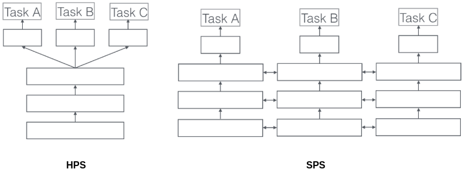

# Multi-task Learning

MTL enables the model to generalize better on the primary task through sharing representations with associated auxiliary tasks simultaneously. In AccSR, the auxiliary task is accent classification.

## Ruder (2017)

Ruder offers a survey on MTL in DNNs. The key idea of MTL is that by sharing representations between related tasks, we can enable our model to generalize better on our original task. MTL improves generalization by leveraging the domain-specific information contained in the training signals of related tasks (Caruana 1998). We can view MTL as a form of inductive transfer. Inductive transfer can help improve a model by introducing an inductive bias, which causes a model to prefer some hypotheses over others.

MTL is typically done with either hard or soft parameter sharing of hidden layers. *Hard parameter sharing (HPS)* is generally applied by sharing the hidden layers between all tasks, while keeping several task-specific output layers. HPS greatly reduces the risk of overfitting (Baxter 1997). This makes sense intuitively: the more tasks we are learning simultaneously, the more our model has to find a representation that captures all of the tasks and the less is our chance of overfitting on our original task.

In *soft parameter sharing (SPS)* on the other hand, each task has its own model with its own parameters. The distance between the parameters of the model is then regularized in order to encourage the parameters to be similar.

Ruder states a couple of factors behind MTL's success:

1. As different tasks have different noise patterns, a model that learns two tasks simultaneously is able to learn a more general representation.
2. MTL can help the model focus its attention on those features that actually matter as other tasks will provide additional evidence for the relevance or irrelevance of those features.
3. MTL allows the primary model to learn features through the auxiliary tasks that are otherwise harder to identify.
4. MTL biases the model to prefer representations that other tasks also prefer.
5. MTL acts as a regularizer by introducing an inductive bias.